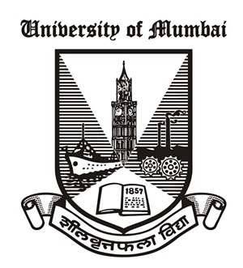

# Computer Engineering

### Bachelor of Engineering · Academic Repository

**A comprehensive directory of academic coursework, projects, reference materials, and learning resources from a four-year Computer Engineering program.**

[◎ Motivation](#motivation) &nbsp;·&nbsp; [☰ Curriculum](#course-catalog) &nbsp;·&nbsp; [★ Project Showcase](#project-showcase) &nbsp;·&nbsp; [© License](#license)

---

<!-- AUTHORS -->

  
  ## Author

|  [**Amey Thakur**](https://github.com/Amey-Thakur)   |
| :---: |

---

## Overview

This repository serves as a centralized index to all academic work completed during the Bachelor of Engineering program in Computer Engineering at [Terna Engineering College](https://ternaengg.ac.in/), affiliated with the [University of Mumbai](https://mu.ac.in/). Each linked repository contains lecture notes, laboratory assignments, project implementations, reference materials, and supplementary resources for the respective course.

**Purpose**: To provide organized access to educational content spanning eight semesters of undergraduate study, facilitating knowledge sharing and academic reference.

**Target Audience**: Students, educators, researchers, and professionals seeking reference materials in computer science and engineering disciplines.

---

## Motivation

Education is not a destination but a continuous journey. This repository represents my commitment to that philosophy: a deliberate effort to preserve, organize, and revisit the foundational knowledge acquired during my undergraduate studies in Computer Engineering.

The creation of this archive stems from a fundamental belief: **true learning transcends the classroom and extends far beyond graduation**. As I navigate my professional career, I recognize that the concepts, methodologies, and problem-solving frameworks developed during these formative years remain invaluable. However, knowledge, when not actively maintained, fades. This repository serves as my intellectual foundation: a structured collection I can return to for relearning, reference, and reflection.

**Why this repository exists:**

- **Knowledge Preservation**: To capture and maintain the depth of understanding developed across eight semesters of rigorous study
- **Continuous Learning**: To create a resource that supports lifelong learning, enabling me to revisit fundamental principles as I encounter advanced challenges
- **Academic Integrity**: To document my authentic academic journey - every concept studied, every project implemented, every problem solved
- **Open Contribution**: To share these materials with the broader community, believing that knowledge grows when freely exchanged

This is more than a collection of files or a digital archive. It is a testament to four years of intellectual growth, a record of challenges overcome, and a foundation upon which future learning will be built. By making this work publicly available, I hope it serves not only my own continued education but also assists others on their learning journeys.

> [!NOTE]
> All materials in this repository were created, compiled, and organized by me throughout my undergraduate program (2018-2022) as part of my coursework, laboratory assignments, and project implementations.

---

## Course Catalog

The curriculum is organized chronologically by academic year and semester, progressing from foundational engineering principles to advanced computing specializations.

> [!TIP]
> Each **Course** and **Lab** link navigates directly to a dedicated repository containing extensive lecture notes, assignment solutions, and reference materials for that specific subject.

### First Year Engineering
**Department of General Engineering**

#### Semester I

| Code | Course Title | Repository | Project |
|:----:|:-------------|:----------:|:-------:|
| FEC101 | Applied Mathematics - I | — | — |
| FEC102 | Applied Physics - I | — | — |
| FEC103 | Applied Chemistry - I | — | — |
| FEC104 | Engineering Mechanics | — | — |
| FEC105 | Basic Electrical Engineering | — | — |
| FEC106 | Environmental Studies | — | — |
| FEL101 | Basic Workshop Practice - I | — | — |

#### Semester II

| Code | Course Title | Repository | Project |
|:----:|:-------------|:----------:|:-------:|
| FEC201 | Applied Mathematics - II | — | — |
| FEC202 | Applied Physics - II | — | — |
| FEC203 | Applied Chemistry - II | — | — |
| FEC204 | Engineering Drawing | — | — |
| FEC205 | Structured Programming Approach | — | — |
| FEC206 | Communication Skills | — | — |
| FEL201 | Basic Workshop Practice - II | — | — |

---

### Second Year Engineering
**Department of Computer Engineering**

#### Semester III

| Code | Course Title | Repository | Project |
|:----:|:-------------|:----------:|:-------:|
| CSC301 | Applied Mathematics - III | [Course](https://github.com/Amey-Thakur/APPLIED-MATHEMATICS-III) | — |
| CSC302 | Digital Logic Design and Analysis | [Course](https://github.com/Amey-Thakur/DIGITAL-LOGIC-DESIGN-AND-ANALYSIS-AND-DIGITAL-SYSTEM-LAB) | — |
| CSC303 | Discrete Mathematics | [Course](https://github.com/Amey-Thakur/DISCRETE-MATHEMATICS) | — |
| CSC304 | Electronic Circuits and Communication Fundamentals | [Course](https://github.com/Amey-Thakur/ELECTRONIC-CIRCUITS-AND-COMMUNICATION-FUNDAMENTALS-AND-BASIC-ELECTRONICS-LAB) | — |
| CSC305 | Data Structures | [Course](https://github.com/Amey-Thakur/DATA-STRUCTURES-AND-DATA-STRUCTURES-LAB) | — |
| CSL301 | Digital System Lab | [Lab](https://github.com/Amey-Thakur/DIGITAL-LOGIC-DESIGN-AND-ANALYSIS-AND-DIGITAL-SYSTEM-LAB) | — |
| CSL302 | Basic Electronics Lab | [Lab](https://github.com/Amey-Thakur/ELECTRONIC-CIRCUITS-AND-COMMUNICATION-FUNDAMENTALS-AND-BASIC-ELECTRONICS-LAB) | — |
| CSL303 | Data Structure Lab | [Lab](https://github.com/Amey-Thakur/DATA-STRUCTURES-AND-DATA-STRUCTURES-LAB) | — |
| CSL304 | OOPM (Java) Lab | [Lab](https://github.com/Amey-Thakur/OOPM-JAVA-LAB) | [**Hangman Word Game**](https://github.com/Amey-Thakur/HANGMAN-WORD-GAME) |

#### Semester IV

| Code | Course Title | Repository | Project |
|:----:|:-------------|:----------:|:-------:|
| CSC401 | Applied Mathematics - IV | [Course](https://github.com/Amey-Thakur/APPLIED-MATHEMATICS-IV) | — |
| CSC402 | Analysis of Algorithm | [Course](https://github.com/Amey-Thakur/ANALYSIS-OF-ALGORITHM-AND-ANALYSIS-OF-ALGORITHM-LAB) | — |
| CSC403 | Computer Organization and Architecture | [Course](https://github.com/Amey-Thakur/COMPUTER-ORGANIZATION-AND-ARCHITECTURE-AND-PROCESSOR-ARCHITECTURE-LAB) | — |
| CSC404 | Computer Graphics | [Course](https://github.com/Amey-Thakur/COMPUTER-GRAPHICS-AND-COMPUTER-GRAPHICS-LAB) | — |
| CSC405 | Operating System | [Course](https://github.com/Amey-Thakur/OPERATING-SYSTEM-AND-OPERATING-SYSTEM-LAB) | — |
| CSL401 | Analysis of Algorithms Lab | [Lab](https://github.com/Amey-Thakur/ANALYSIS-OF-ALGORITHM-AND-ANALYSIS-OF-ALGORITHM-LAB) | — |
| CSL402 | Computer Graphics Lab | [Lab](https://github.com/Amey-Thakur/COMPUTER-GRAPHICS-AND-COMPUTER-GRAPHICS-LAB) | [**AR Stack Game**](https://github.com/Amey-Thakur/AR-STACK-GAME) |
| CSL403 | Processor Architecture Lab | [Lab](https://github.com/Amey-Thakur/COMPUTER-ORGANIZATION-AND-ARCHITECTURE-AND-PROCESSOR-ARCHITECTURE-LAB) | — |
| CSL404 | Operating System Lab | [Lab](https://github.com/Amey-Thakur/OPERATING-SYSTEM-AND-OPERATING-SYSTEM-LAB) | [**Interest Calculator**](https://github.com/Amey-Thakur/SIMPLE-AND-COMPOUND-INTEREST-CALCULATOR) |
| CSL405 | Open Source Tech Lab | [Lab](https://github.com/Amey-Thakur/OPEN-SOURCE-TECH-LAB) | [**COVID-19 Web Scraper**](https://github.com/Amey-Thakur/COVID19-WEB-SCRAPER) |

---

### Third Year Engineering
**Department of Computer Engineering**

#### Semester V

| Code | Course Title | Repository | Project |
|:----:|:-------------|:----------:|:-------:|
| CSC501 | Microprocessor | [Course](https://github.com/Amey-Thakur/MICROPROCESSOR-AND-MICROPROCESSOR-LAB) | — |
| CSC502 | Database Management System | [Course](https://github.com/Amey-Thakur/DATABASE-MANAGEMENT-SYSTEM-AND-DATABASE-MANAGEMENT-SYSTEM-LAB) | — |
| CSC503 | Computer Network | [Course](https://github.com/Amey-Thakur/COMPUTER-NETWORK-AND-COMPUTER-NETWORK-LAB) | — |
| CSC504 | Theory of Computer Science | [Course](https://github.com/Amey-Thakur/THEORY-OF-COMPUTER-SCIENCE) | — |
| CSDLO5011 | Multimedia System | [Course](https://github.com/Amey-Thakur/MULTIMEDIA-SYSTEM) | — |
| CSL501 | Microprocessor Lab | [Lab](https://github.com/Amey-Thakur/MICROPROCESSOR-AND-MICROPROCESSOR-LAB) | [**8086 ASM**](https://github.com/Amey-Thakur/8086-ASSEMBLY-LANGUAGE-PROGRAMS) |
| CSL502 | Computer Network Lab | [Lab](https://github.com/Amey-Thakur/COMPUTER-NETWORK-AND-COMPUTER-NETWORK-LAB) | — |
| CSL503 | Database Management System Lab | [Lab](https://github.com/Amey-Thakur/DATABASE-MANAGEMENT-SYSTEM-AND-DATABASE-MANAGEMENT-SYSTEM-LAB) | [**Car Rental System**](https://github.com/Amey-Thakur/CAR-RENTAL-SYSTEM) |
| CSL504 | Web Design Lab | [Lab](https://github.com/Amey-Thakur/WEB-DESIGNING-LAB) | [**Chat Room**](https://github.com/Amey-Thakur/CHAT-ROOM) |
| CSL505 | Business Communication & Ethics | [Course](https://github.com/Amey-Thakur/BUSINESS-COMMUNICATION-AND-ETHICS) | — |

#### Semester VI

| Code | Course Title | Repository | Project |
|:----:|:-------------|:----------:|:-------:|
| CSC601 | Software Engineering | [Course](https://github.com/Amey-Thakur/SOFTWARE-ENGINEERING-AND-SOFTWARE-ENGINEERING-LAB) | — |
| CSC602 | System Programming and Compiler Construction | [Course](https://github.com/Amey-Thakur/SYSTEM-PROGRAMMING-AND-COMPILER-CONSTRUCTION-AND-SYSTEM-SOFTWARE-LAB) | — |
| CSC603 | Data Warehousing and Mining | [Course](https://github.com/Amey-Thakur/DATA-WAREHOUSING-AND-MINING-AND-DATA-WAREHOUSING-AND-MINING-LAB) | — |
| CSC604 | Cryptography and System Security | [Course](https://github.com/Amey-Thakur/CRYPTOGRAPHY-AND-SYSTEM-SECURITY-AND-SYSTEM-SECURITY-LAB) | — |
| CSDLO6021 | Machine Learning | [Course](https://github.com/Amey-Thakur/MACHINE-LEARNING) | — |
| CSL601 | Software Engineering Lab | [Lab](https://github.com/Amey-Thakur/SOFTWARE-ENGINEERING-AND-SOFTWARE-ENGINEERING-LAB) | [**Digital Bookstore**](https://github.com/Amey-Thakur/DIGITAL-BOOKSTORE) |
| CSL602 | System Software Lab | [Lab](https://github.com/Amey-Thakur/SYSTEM-PROGRAMMING-AND-COMPILER-CONSTRUCTION-AND-SYSTEM-SOFTWARE-LAB) | — |
| CSL603 | Data Warehousing and Mining Lab | [Lab](https://github.com/Amey-Thakur/DATA-WAREHOUSING-AND-MINING-AND-DATA-WAREHOUSING-AND-MINING-LAB) | — |
| CSL604 | System Security Lab | [Lab](https://github.com/Amey-Thakur/CRYPTOGRAPHY-AND-SYSTEM-SECURITY-AND-SYSTEM-SECURITY-LAB) | — |
| CSM605 | Mini-Project | — | [**White-Box Cartoonization**](https://github.com/Amey-Thakur/WHITE-BOX-CARTOONIZATION) |

---

### Fourth Year Engineering
**Department of Computer Engineering**

#### Semester VII

| Code | Course Title | Repository | Project |
|:----:|:-------------|:----------:|:-------:|
| CSC701 | Digital Signal and Image Processing | [Course](https://github.com/Amey-Thakur/DIGITAL-SIGNAL-AND-IMAGE-PROCESSING-AND-DIGITAL-SIGNAL-AND-IMAGE-PROCESSING-LAB) | — |
| CSC702 | Mobile Communication and Computing | [Course](https://github.com/Amey-Thakur/MOBILE-COMMUNICATION-AND-COMPUTING-AND-MOBILE-APPLICATION-DEVELOPMENT-LAB) | — |
| CSC703 | Artificial Intelligence and Soft Computing | [Course](https://github.com/Amey-Thakur/ARTIFICIAL-INTELLIGENCE-AND-SOFT-COMPUTING-AND-ARTIFICIAL-INTELLIGENCE-AND-SOFT-COMPUTING-LAB) | — |
| CSDLO7032 | Big Data Analytics | [Course](https://github.com/Amey-Thakur/BIG-DATA-ANALYTICS-AND-COMPUTATIONAL-LAB-I) | — |
| ILO7013 | Management Information System | [Course](https://github.com/Amey-Thakur/MANAGEMENT-INFORMATION-SYSTEM) | — |
| CSL701 | Digital Signal and Image Processing Lab | [Lab](https://github.com/Amey-Thakur/DIGITAL-SIGNAL-AND-IMAGE-PROCESSING-AND-DIGITAL-SIGNAL-AND-IMAGE-PROCESSING-LAB) | — |
| CSL702 | Mobile Application Development Lab | [Lab](https://github.com/Amey-Thakur/MOBILE-COMMUNICATION-AND-COMPUTING-AND-MOBILE-APPLICATION-DEVELOPMENT-LAB) | — |
| CSL703 | Artificial Intelligence and Soft Computing Lab | [Lab](https://github.com/Amey-Thakur/ARTIFICIAL-INTELLIGENCE-AND-SOFT-COMPUTING-AND-ARTIFICIAL-INTELLIGENCE-AND-SOFT-COMPUTING-LAB) | — |
| CSL704 | Computational Lab - I | [Lab](https://github.com/Amey-Thakur/BIG-DATA-ANALYTICS-AND-COMPUTATIONAL-LAB-I) | [**K-Means Stock Trading**](https://github.com/Amey-Thakur/OPTIMIZING-STOCK-TRADING-STRATEGY-WITH-K-MEANS-CLUSTERING) |
| CSP705 | Major Project - I | — | [**Quadtree Visualizer**](https://github.com/Amey-Thakur/QUADTREE-VISUALIZER) |

#### Semester VIII

| Code | Course Title | Repository | Project |
|:----:|:-------------|:----------:|:-------:|
| CSC801 | Human Machine Interaction | [Course](https://github.com/Amey-Thakur/HUMAN-MACHINE-INTERACTION-AND-HUMAN-MACHINE-INTERACTION-LAB) | — |
| CSC802 | Distributed Computing | [Course](https://github.com/Amey-Thakur/DISTRIBUTED-COMPUTING-AND-DISTRIBUTED-COMPUTING-LAB) | — |
| DLO8012 | Natural Language Processing | [Course](https://github.com/Amey-Thakur/NATURAL-LANGUAGE-PROCESSING-AND-COMPUTATIONAL-LAB-II) | — |
| ILO8022 | Finance Management | [Course](https://github.com/Amey-Thakur/FINANCE-MANAGEMENT) | — |
| CSL801 | Human Machine Interaction Lab | [Lab](https://github.com/Amey-Thakur/HUMAN-MACHINE-INTERACTION-AND-HUMAN-MACHINE-INTERACTION-LAB) | [**Online Chess Game**](https://github.com/Amey-Thakur/ONLINE-CHESS-GAME) |
| CSL802 | Distributed Computing Lab | [Lab](https://github.com/Amey-Thakur/DISTRIBUTED-COMPUTING-AND-DISTRIBUTED-COMPUTING-LAB) | — |
| CSL803 | Cloud Computing Lab | [Lab](https://github.com/Amey-Thakur/CLOUD-COMPUTING-LAB) | [**AWS Certified Cloud Practitioner**](https://github.com/Amey-Thakur/AWS-CERTIFIED-CLOUD-PRACTITIONER-CLF-C01) |
| CSL804 | Computational Lab - II | [Lab](https://github.com/Amey-Thakur/NATURAL-LANGUAGE-PROCESSING-AND-COMPUTATIONAL-LAB-II) | [**Text Summarizer**](https://github.com/Amey-Thakur/TEXT-SUMMARIZER) |
| CSP805 | Major Project - II | — | [**Quadtree Visualizer**](https://github.com/Amey-Thakur/QUADTREE-VISUALIZER) |

---

## Project Showcase

A curated collection of engineering projects developed throughout the program, demonstrating practical application of theoretical concepts across various domains of computer science.

  &nbsp; <b>Watch All Projects:</b> <a href="https://youtube.com/playlist?list=PLGOc13Pt03SZ9INe4gyxoZnA4zAXssiLn">Engineering Projects YouTube Playlist</a>

> [!IMPORTANT]
> The **Quadtree Visualizer** serves as the major capstone implementation, synthesizing concepts from Big Data Analytics, Data Structures, and Computational Algorithms into a unified research-based project.

### Featured Projects

- [x] **[Quadtree Visualizer](https://github.com/Amey-Thakur/QUADTREE-VISUALIZER)** · Major Capstone Project (Semesters VII-VIII)
- [x] **[AWS Certified Cloud Practitioner](https://github.com/Amey-Thakur/AWS-CERTIFIED-CLOUD-PRACTITIONER-CLF-C01)** · Cloud Computing Certification (Semester VIII)
- [x] **[Text Summarizer](https://github.com/Amey-Thakur/TEXT-SUMMARIZER)** · Natural Language Processing (Semester VIII)
- [x] **[Online Chess Game](https://github.com/Amey-Thakur/ONLINE-CHESS-GAME)** · Human-Machine Interaction (Semester VIII)
- [x] **[K-Means Stock Trading](https://github.com/Amey-Thakur/OPTIMIZING-STOCK-TRADING-STRATEGY-WITH-K-MEANS-CLUSTERING)** · Big Data Analytics (Semester VII)
- [x] **[White-Box Cartoonization](https://github.com/Amey-Thakur/WHITE-BOX-CARTOONIZATION)** · Computer Vision Mini-Project (Semester VI)
- [x] **[Digital Bookstore](https://github.com/Amey-Thakur/DIGITAL-BOOKSTORE)** · Software Engineering (Semester VI)
- [x] **[Car Rental System](https://github.com/Amey-Thakur/CAR-RENTAL-SYSTEM)** · Database Management (Semester V)
- [x] **[Chat Room](https://github.com/Amey-Thakur/CHAT-ROOM)** · Web Designing (Semester V)
- [x] **[8086 ASM](https://github.com/Amey-Thakur/8086-ASSEMBLY-LANGUAGE-PROGRAMS)** · Microprocessor Programming (Semester V)
- [x] **[COVID-19 Web Scraper](https://github.com/Amey-Thakur/COVID19-WEB-SCRAPER)** · Open Source Technologies (Semester IV)
- [x] **[Interest Calculator](https://github.com/Amey-Thakur/SIMPLE-AND-COMPOUND-INTEREST-CALCULATOR)** · Operating Systems (Semester IV)
- [x] **[AR Stack Game](https://github.com/Amey-Thakur/AR-STACK-GAME)** · Computer Graphics (Semester IV)
- [x] **[Hangman Word Game](https://github.com/Amey-Thakur/HANGMAN-WORD-GAME)** · Object Oriented Programming (Semester III)

> [!NOTE]
> All projects listed above are verified implementations. Detailed visual demonstrations, technical reports, and environment configuration guides are available within their respective repositories.

---

### Additional Initiatives

**🧠 Advanced Machine Learning & Research**
- [x] **[ResearchGate Archive](https://github.com/Amey-Thakur/RESEARCHGATE)** · Technical Companion & Scholarly Mirror
- [x] **[Deepfake Audio Synthesis](https://github.com/Amey-Thakur/DEEPFAKE-AUDIO)** · Neural TTS Zero-Shot Voice Cloning
- [x] **[Sentiment Analyzer](https://github.com/Amey-Thakur/SENTIMENT-ANALYZER)** · Hybrid NLP Sentiment Analysis Engine
- [x] **[Depression Detection](https://github.com/Amey-Thakur/DEPRESSION_DETECTION_USING_TWEETS)** · Predictive NLP Pipeline for Mental Health Analysis

**🧠 Data Science & Intelligent Trading**
- [x] **[Stock Trading Strategy RL](https://github.com/Amey-Thakur/OPTIMIZING-STOCK-TRADING-STRATEGY-WITH-REINFORCEMENT-LEARNING)** · Q-Learning Portfolio Optimization
- [x] **[Reinforcement Learning Strategy](https://github.com/Amey-Thakur/Optimizing-Stock-Trading-Using-Reinforcement-Learning-DST)** · Technocolabs Machine Learning Internship
- [x] **[Kaggle Courses](https://github.com/Amey-Thakur/KAGGLE-COURSES)** · Mastery Archive of ML & Data Science Certifications
- [x] **[House Price Prediction](https://github.com/Amey-Thakur/BANGALORE-HOUSE-PRICE-PREDICTION)** · Multivariate Regression Analysis Study
- [x] **[Unsupervised ML](https://github.com/Amey-Thakur/TSF-UNSUPERVISED-MACHINE-LEARNING)** · The Sparks Foundation Internship
- [x] **[Supervised ML](https://github.com/Amey-Thakur/TSF-SUPERVISED-MACHINE-LEARNING)** · The Sparks Foundation Internship

**🌐 Modern Web & Distributed Systems**
- [x] **[React Todo App](https://github.com/Amey-Thakur/REACT-TODO-APP)** · React Web Application Implementation
- [x] **[Tic-Tac-Toe in Angular](https://github.com/Amey-Thakur/TIC-TAC-TOE-ANGULAR-FRAMEWORK)** · Angular Web Application Implementation
- [x] **[JavaScript Frameworks](https://github.com/Amey-Thakur/JAVASCRIPT-FRAMEWORKS)** · Comparative Study of 10 Modern Frameworks
- [x] **[Hangman in Django](https://github.com/Amey-Thakur/HANGMAN-GAME-IN-DJANGO-PYTHON)** · RESTful Django Web Implementation
- [x] **[Hadoop](https://github.com/Amey-Thakur/HADOOP)** · Big Data Analytics & Distributed Computing (Semester VII)

**💎 Ruby & Rails Ecosystem**
- [x] **[Ruby on Rails FriendsApp](https://github.com/Amey-Thakur/RUBY-ON-RAILS-FRIENDSAPP)** · Ruby on Rails Web Application
- [x] **[RailsFriends](https://github.com/Amey-Thakur/RAILSFRIENDS)** · Ruby on Rails Implementation (Mirror)
- [x] **[30 Days of Ruby](https://github.com/Amey-Thakur/RUBY)** · Language Mastery Challenge
- [x] **[Hangman in Ruby](https://github.com/Amey-Thakur/HANGMAN-IN-RUBY)** · Ruby Programming Challenge
- [x] **[Tic-Tac-Toe in Ruby](https://github.com/Amey-Thakur/TIC-TAC-TOE-IN-RUBY)** · Ruby Programming Challenge

**🏅 Logic Synthesis & Language Mastery**
- [x] **[Python Shorts](https://github.com/Amey-Thakur/PYTHON-SHORTS)** · Algorithms & Logic Synthesis (100+ Programs)
- [x] **[Python Crash Course](https://github.com/Amey-Thakur/PYTHON-CRASH-COURSE)** · 12-Day Mastery Challenge
- [x] **[30 Days of R](https://github.com/Amey-Thakur/R)** · Statistical Computing Challenge
- [x] **[50 Days of Julia](https://github.com/Amey-Thakur/JULIA)** · Scientific Computing Challenge

**🎮 HMI Lab & Game Development**
- [x] **[The Math Game](https://github.com/Amey-Thakur/THE-MATH-GAME)** · Human Machine Interaction (Semester VIII)
- [x] **[Math Sprint Game](https://github.com/Amey-Thakur/MATH-SPRINT-GAME)** · Human Machine Interaction (Semester VIII)
- [x] **[Rock Paper Scissors](https://github.com/Amey-Thakur/ROCK-PAPER-SCISSORS)** · Human Machine Interaction (Semester VIII)
- [x] **[ATVM Interface](https://github.com/Amey-Thakur/ATVM-INTERFACE)** · Human Machine Interaction (Semester VIII)
- [x] **[Flappy Bird](https://github.com/Amey-Thakur/FLAPPY-BIRD-USING-PYGAME)** · Python Game Development
- [x] **[Pong Game](https://github.com/Amey-Thakur/PONG-GAME)** · Python Game Development

**📱 Mobile & Lab Components**
- [x] **[Android Studio Flashlight](https://github.com/Amey-Thakur/ANDROID-STUDIO-FLASHLIGHT)** · Independent Android Application
- [x] **[Android Studio Calculator](https://github.com/Amey-Thakur/ANDROID-STUDIO-CALCULATOR)** · Independent Android Application
- [x] **[Search Space Explore Extent](https://github.com/Amey-Thakur/SEARCH-SPACE-EXPLORE-EXTENT)** · Web Designing Lab Component (Semester V)
- [x] **[Lunar Design Studio](https://github.com/Amey-Thakur/LUNAR-DESIGN-STUDIO)** · Independent Web Design

**🎖️ Commendations**
- [x] **[Achievements](https://github.com/Amey-Thakur/ACHIEVEMENTS)** · Record of Certifications & Commendations

---

## Usage Guidelines

This repository is openly shared to support learning and knowledge exchange across the academic community.

**For Students**  
Use these repositories as reference materials for understanding concepts, reviewing implementations, and exploring project ideas. Each repository contains detailed documentation to facilitate self-paced learning.

**For Educators**  
These resources may serve as curriculum references, assignment examples, or supplementary teaching materials. Attribution is appreciated when utilizing content.

**For Researchers**  
The project implementations and documentation may provide insights into practical applications of computer science principles in educational contexts.

---

## License

This repository and all linked academic content are made available under the **Creative Commons Attribution 4.0 International License (CC BY 4.0)**. See the [LICENSE](LICENSE) file for complete terms.

> [!NOTE]
> **Summary**: You are free to share and adapt this content for any purpose, even commercially, as long as you provide appropriate attribution to the original author.

Copyright © 2018 - 2022 Amey Thakur

---

## About This Repository

**Created & Maintained by**: [Amey Thakur](https://github.com/Amey-Thakur)

This repository represents a comprehensive academic archive of my intellectual journey throughout the Bachelor of Engineering program in Computer Engineering (2018-2022). It acts as a centralized index for over 50+ repositories involving core algorithms, laboratory implementations, and complex systems architecture. This digital legacy serves as both a formal reference for the academic community and a testament to the rigorous engineering standards maintained across eight semesters of undergraduate study.

**Connect:** [GitHub](https://github.com/Amey-Thakur) &nbsp;·&nbsp; [LinkedIn](https://www.linkedin.com/in/amey-thakur) &nbsp;·&nbsp; [ORCID](https://orcid.org/0000-0001-5644-1575)

### Acknowledgments

**Institution**: [Terna Engineering College](https://ternaengg.ac.in/), Navi Mumbai  
**University**: [University of Mumbai](https://mu.ac.in/)  
**Program**: Bachelor of Engineering in Computer Engineering  
**Duration**: 2018 - 2022

Grateful acknowledgment to the faculty of **Terna Engineering College** for their pedagogical leadership, and to my mentors and peers for the intellectual synergy that defined this four-year academic journey. Their contributions to my learning experience are deeply appreciated.

---

<!-- FOOTER -->

  [↑ Back to Top](#computer-engineering)

  [◎ Motivation](#motivation) &nbsp;·&nbsp; [☰ Curriculum](#course-catalog) &nbsp;·&nbsp; [★ Project Showcase](#project-showcase) &nbsp;·&nbsp; [© License](#license)

---

### 🎓 [Computer Engineering Repository](https://github.com/Amey-Thakur/COMPUTER-ENGINEERING)

**Computer Engineering (B.E.) - University of Mumbai**

*Semester-wise curriculum, laboratories, projects, and academic notes.*

